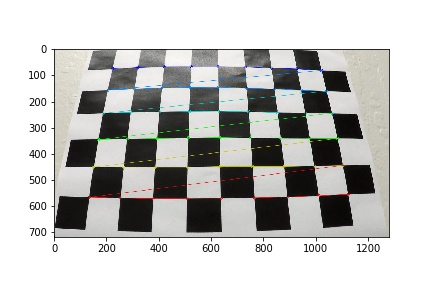
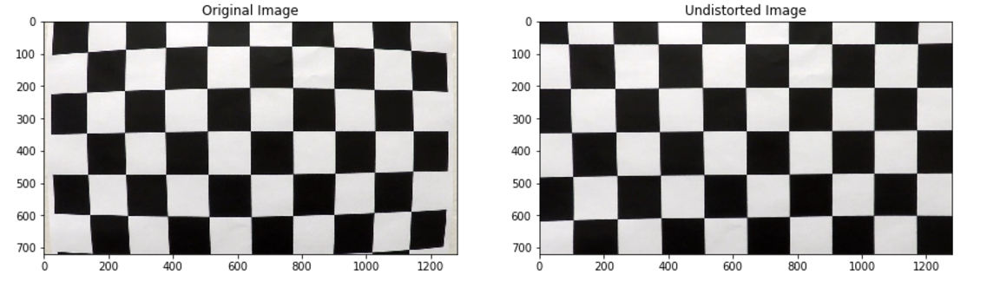
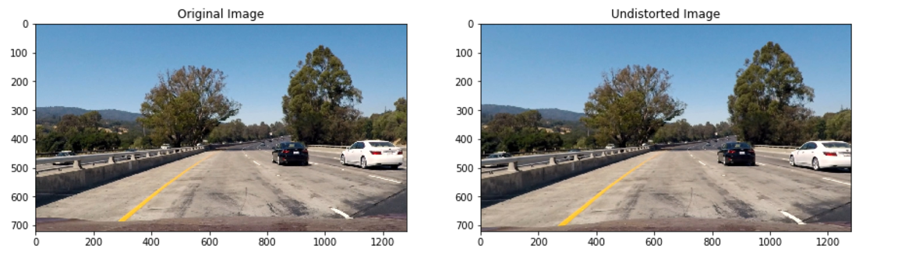
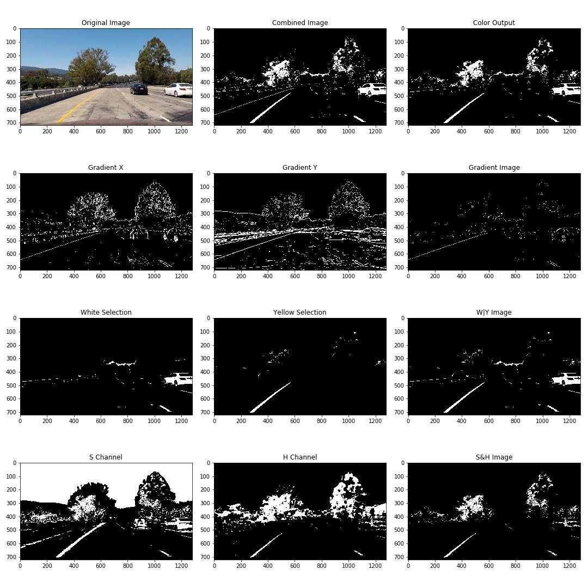
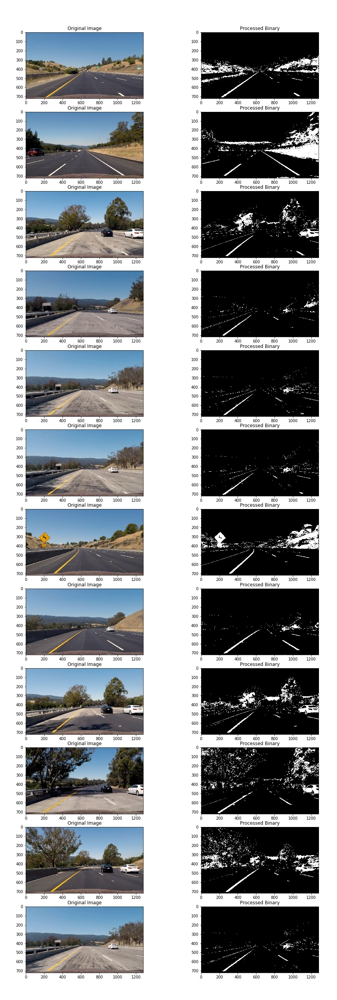
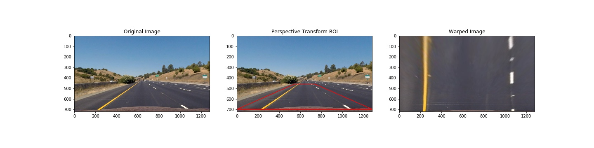
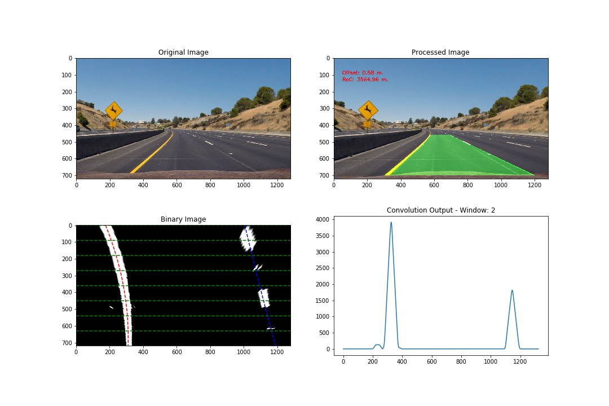

# Advanced Lane Finding

The goals / steps of this project are the following:

- Compute the camera calibration matrix and distortion coefficients given a set of chessboard images.
- Apply a distortion correction to raw images.
- Use color transforms, gradients, etc., to create a thresholded binary image.
- Apply a perspective transform to rectify binary image ("birds-eye view").
- Detect lane pixels and fit to find the lane boundary.
- Determine the curvature of the lane and vehicle position with respect to center.
- Warp the detected lane boundaries back onto the original image.
- Output visual display of the lane boundaries and numerical estimation of lane curvature and vehicle position.

## 1. Camera Calibration

The first step of the exercise is to correctly calibrate the camera and and calculate the distortion co-efficients so that the input images can be undistorted prior to processing. The OpenCV functions ```cv2.findChessboardCorners()``` and ```cv2.drawChessboardCorners()``` are used to first find the corners of a 9x6 chessboard and determine the calibration matrix to calibrate the camera. The image below shows an example of the corners identified.

Original Image             |  Image with corners 
:-------------------------:|:-------------------------:
  |    

The identified corners are stored in the ```img_points``` array and transformed to the prepared ```obj_points``` array which consists of a square grid. The image below shows an example of an undistorted chessboard image once the calibration matrix has been calculated. Please refer to code block 4 in the project notebook for details.



## 2. Image pipeline

### 2.1 Undistort Image
The first step in the image pipeline is to undistort the input images using the calibration matrix calculated earlier. The image below shows a comparison of a distorted and undistorted test image.



Next a combination of gradient and color thresholding is applied to extract the lane locations from the image.

The sobel-x and sobel-y binaries are first obtained by thresholding the sobel gradients in each direction, the result binary images are bit-wise AND'ed to extract the lane lines and stripes with high confidence. This approach works well for images that are well illuminated and the lane lines are pronounced which is the case for the project video. A bit-wise AND operation on these images captures mostly the lane lines and eliminates the noise picked up by the sobel-y binary. A gaussian blur is then applied to the combined image to further smooth the image.

### 2.2 Color & Gradient Thresholding
Next, a yellow and white threshold is applied to the image in the HSV color space as shown in the code block below:

```
def yellow_selector(img):
    img = cv2.cvtColor(img, cv2.COLOR_RGB2HSV)
    lower_yellow_threshold = np.asarray([10, 100, 100])
    upper_yellow_threshold = np.asarray([50, 255, 255])
    binary_img = cv2.inRange(img, lower_yellow_threshold, upper_yellow_threshold)
    #binary_img = cv2.bitwise_and(img, img, mask=mask)
    return binary_img/255

def white_selector(img):
    img = cv2.cvtColor(img, cv2.COLOR_RGB2HSV)
    lower_white_threshold = np.array([0,0,200], dtype = np.uint8)
    upper_white_threshold = np.array([255,30,255], dtype = np.uint8)
    binary_img = cv2.inRange(img, lower_white_threshold, upper_white_threshold)
    return binary_img/255
```
The upper and lower bounds for each color were obtained after experimentation with the images using Adobe Photoshop. Photoshop's color selection feature was then used to obtain the HSV (HSB in photoshop) values for the lane lines at several points and used as a starting point for the color selector functions. The resulting binaries were OR'ed to obtain both the yellow and white lane lines.

Next, the image was transformed into HLS color space and the S and H channels were extracted. It was found that under certain lighting conditions, the H and S channels were more reliable than the color selectors. As a result, the H and S channels were bitwise AND'ed and the resulting image was OR'ed with the combinted yellow and white threshold image. This final image is refered to as ```color_output``` in the code block below. This binary image was OR'ed with the result of the sobel gradient operations ```grad_output``` to obtain a final output image.

```
x_binary = abs_sobel_thresh(image, 'x', 5, sobel_thresh)
y_binary = abs_sobel_thresh(image, 'y', 3, sobel_thresh)
S_binary = HLS_threshold(image, 'S', S_thresh)
H_binary = HLS_threshold(image, 'H', H_thresh)
W_binary = white_selector(image)
Y_binary = yellow_selector(image)

color_output = OR_binaries(OR_binaries(W_binary, Y_binary), AND_binaries(S_binary, H_binary))
grad_output = blur_gradient(AND_binaries(x_binary, y_binary))
output = OR_binaries(color_output, grad_output)
```
The complete operation with individual binaries and their combinations is shown in the image below:


Additional test images were then extracted from the project video using the following code block:
```
#Reference: https://stackoverflow.com/questions/27481993/extracting-image-from-video-at-a-given-time-using-opencv
#Extract images from video
vidcap = cv2.VideoCapture('project_video.mp4')
vidcap.set(cv2.CAP_PROP_POS_MSEC,1370)      
success,image = vidcap.read()
if success:
    cv2.imwrite("test_images\\test.jpg", image)    
    cv2.imshow("Test Image",image)
    cv2.waitKey()
```
The thresholding was tested on all the test images. The results are shown below:


### 2.3 Perspective Transformation

The perspective transform is performed by the ```warp_image()``` function which takes the input image, source points and destination points as arguments. A region of interest was drawn on the image to mask the lane lines and warped so that the vertical edges of the resulting polygon appeared parallel in the output image. The source points were tweaked so that lane lines that were expected to be straight appeared straight and parallel in the warped image.
```
def warp_image(img, src, dst):
    img_size = (img.shape[1], img.shape[0])
    M = cv2.getPerspectiveTransform(src, dst)
    img = cv2.warpPerspective(img, M, img_size, flags = cv2.INTER_LINEAR)
    return img
```
The source and destination points used were as follows:

|              | Source      | Destination |
|--------------|-------------|-------------|
| Bottom Left  | (0, 700)    | (0, 720)    |
| Top Left     | (545, 460)  | (0, 0)      |
| Top Right    | (735, 460)  | (1280, 0)   |
| Bottom Right | (1280, 700) | (1280, 720) |

The image below shows the ROI used and transformed image using an RGB input image:


### 2.4 Finding the lane lines

The next step is to determine the location of the lane lines in the transformed image using the ```find_centers()``` function.. The image is split into horizontal slices of number ```n_windows``` and summed vertically along each pixel column to obtain the count of non-zero pixels in each column. The resulting array of shape (1280,) is then convolved with a convolution windows of width ```window_width``` and height ```windows_height```. The position of the maximum value from the resulting convolution is returned and corrected for the width of the convolution window.

The convolution process starts at the base of the image which is closest to the vehicle. The ```scan_slice()``` function is used to locate the position of the left and right lane lines. The left and right sides of the images are convolved with the convolution window separately and non-zero values for the x-coordinates are returned value only if the count of non-zero pixels is higher than a threshold of 10. This is done to wean out any noise or artifacts that may bias the result. The returned values are checked to confirm that they are non-zero and make sure a maximum value was actually found. The x-coordinates are then paired with their y-coordinates and appended to either the ```r_centers``` or ```l_centers``` array.

Once a pair of coordinates is located for the left and right lane lines, the ```scan_margin()``` function is used to locate the lane lines on the next window level up. The ```scan_margin()``` function executes only if non-zero values are provided as inputs for the x-coordiantes of both the left and right lanes. Otherwise, the ```scan_slice()``` function is used to identify the lane line coordinates and, once again, only non-zero values are appended to the ```r_centers``` or ```l_centers``` arrays.

Once the arrays are built, the ```check_centers()``` function is used to validate the arrays. The Z-scores for the x-coordinates of the arrays are calculated and any point with a score higher than 1.9 is discarded. This is done to eradicate any outliers from the array of point that may skew the polynomial regression fit.
```
def check_centers(l_centers, r_centers, z_score):
    l_mu = np.mean(l_centers[:,0])
    r_mu = np.mean(r_centers[:,0])
    l_sig = np.std(l_centers[:,0])
    r_sig = np.std(r_centers[:,0])
    lz_score = np.abs(l_centers[:,0] - l_mu)/l_sig
    rz_score = np.abs(r_centers[:,0] - r_mu)/r_sig
    return l_centers[lz_score<z_score], r_centers[rz_score<z_score]
```
Once the centers have been validation, the ```draw_lines()``` function is then used to perform a polynomial fit of order 2, calculate the radius of curvature and draw the lane lines and region bounded by the lane lines. The excerpt below shows the scale factors used to convert (x,y) coordinates from pixel space to real world space. 
```
 #Convert from pixel space to real space
    ym_per_pix = 30/720 # meters per pixel in y dimension
    xm_per_pix = 3.7/700 # meters per pixel in x dimension
```
The ROC is calculated individually for each plotted line and then averaged. The offset of the vehicle from the lane center is then evaluated at the base of the image as follows:
```
 #Measure offset
    x_left = l_coeff[0]*y_eval**deg + l_coeff[1]*y_eval + l_coeff[2]
    x_right = r_coeff[0]*y_eval**deg + r_coeff[1]*y_eval + r_coeff[2]
    lane_center = int((x_left + x_right)/2)
    image_center = int(image.shape[1]/2)
    offset = (lane_center - image_center) * xm_per_pix
```
The plotted lines and region are then unwarped using an inverse transform of source and destination points previously identified and overlayed on the original frame. The upper subplots in the image below show the original and final output of the pipeline. The lower subplots show the binary warped image sliced into eight windows with the polynomial fits overlayed and the convolution result with the 3rd window from the base of the image.



## 3. Video Pipeline

The image pipeline is then applied to the project video clip. The processed video is available at the following link:
[Project Video](https://youtu.be/4l2KjxlFeIc)

## 4. Discussion

The proposed pipeline works fairly well for the project video, however, one major limitation is the lack of smoothing on the plotted lines. A moving average window could be implemented to reduce the variations in the plotted lines from frame to frame.

Additionally, it was noted that the thresholding parameters used on the project video did not work well for the challenge video. A separate set of threshold parameters and a modified ROI were applied to the challenge video with limited success. The pipeline appeared to fail completely in areas that were completed shaded, such as under the bridge in the challenge video. It is assumed that this would be alleviated by using the moving average window discussed above. It is also noted that the sobel gradients do not contribute to the final composite thresholded image and are of limited used in the challenge video.

Adaptive thresholding should improve the performance of the algorithm under varying lighting conditions where the thresholds could be adjusted dynamically. In addition, an automated way to select the source and destination points to perform the perspective transform may also help for varying lane locations.

The following link provides the results for the pipeline on the challenge video. Note the gap in the identified lanes in the region underneath the bridge: [Challenge Video](https://youtu.be/ggPdIPluvak)
